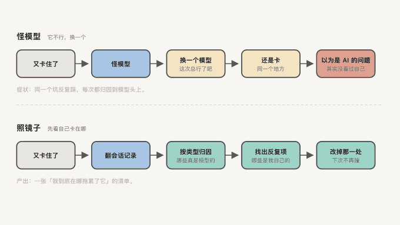

<div align="center">


# agents-deep-insights

**你以为是 AI 不行，其实是你在同一个地方反复绊住它。这个工具扫出你到底卡在哪。**

<p>


</p>

Codex CLI · Claude Code ｜ macOS · Linux · Windows（CI 三平台跑测试，端到端只在 macOS 实测过）

简体中文 ｜ [English](https://github.com/gmggyyds/agents-deep-insights/blob/main/README.en.md)

</div>

---

## 📦 装

```bash
# 不用装，直接跑。默认命令是 stats：纯本地统计，零 LLM、零联网、零额度
npx github:gmggyyds/agents-deep-insights

# 嫌命令长就装成全局，之后直接敲 adi
npm i -g github:gmggyyds/agents-deep-insights
```


npm registry 尚未发布（`npm view agents-deep-insights` 返回 404），所以只能走 `github:` 前缀。

三个命令，边界写死在这张表里：

| 命令 | 调模型 | 联网 | 花额度 | 做什么 |
|---|---|---|---|---|
| `adi stats` | 否 | 否 | 否 | 纯统计，只读本地文件。默认命令 |
| `adi doctor` | 否 | 否 | 否 | 环境自检，`--issue` 输出可直接贴 GitHub 的 markdown |
| `adi run` | 是 | 是 | 是（你自己的） | 完整分析，出 HTML 报告 |

想干什么，就敲哪一条：

```bash
# 「看看最近一周我跟 agent 都在干什么」
adi stats --days 7

# 「环境有没有问题，我要提 issue」
adi doctor --issue

# 「把最近 30 个会话彻底分析一遍，报告放桌面」
adi run --limit 30 --out ~/report.html
```

全部参数：

```
--days <n>        时间窗，默认 30，0 表示全部
--provider <n>    只用某个数据源：codex | claude-code
--json            机器可读输出
--limit <n>       run：分析多少个会话，默认 30
--model <m>       run：指定模型（Codex 版本旧时用 gpt-5.5）
--out <path>      run：报告输出路径
--no-artifacts    run：不落盘中间产物（默认会落，供你复核）
--no-narrative    run：跳过叙事合成，只出统计，省一次调用
--no-english      run：不生成英文版，省一次调用
--no-schema       run：降级到 prompt-only，不推荐，理由见下文
--no-open         run：不自动打开浏览器
--issue           doctor：输出可直接贴 GitHub 的诊断 markdown
```

已分析过的会话按内容指纹缓存，重跑不会重复烧额度。

## 🎯 它解决什么

**第一层疼：反复出的问题，你说不出「几次」。**

你每天跟 agent 干活，同一类事一犯再犯——改 A 弄坏 B、你上周明明说过的规矩它这周照样不守、
某个工具老是失败。但你说不出这些各发生了几次、哪些只是这周的偶发、哪些已经跟了你一个月。
于是你既写不出该往 AGENTS.md 里加哪条规则，也判断不了加完到底有没有用。
会话记录就躺在 `~/.codex/sessions` 和 `~/.claude/projects` 里，几万个 jsonl 文件，
没人读得完，等于没有。

**第二层疼：就算有报告，读完还是不知道该动手改什么。**

Claude Code 有内置 `/insights`，Codex CLI 什么都没有。而 `/insights` 把 12 类摩擦混在一张表里——
你分不清哪些是自己能改的、哪些是模型现在就做不到、哪些是环境的锅。看完点点头，第二天什么都没变。

**第三层疼：想深挖，就得把工作会话交出去。**

会话里有 API key、有客户名、有报价、有利润数字。贴进网页版就是数据外流。
这不是假想需求：开发过程中从一段真实会话提取内容，里面直接带着一个可用的登录 token。

这个工具做三件事：把几万个 jsonl 变成有次数、有原话、可核对的摩擦报告；
把摩擦按「你自己能改的 / 模型能力所限 / 环境问题」拆开，只从第一类生成可直接粘进 AGENTS.md 的规则；
采集与统计全部在本地跑，深度分析那一步把**脱敏后的片段**发给**你自己已经配置好的模型**（`codex exec`），
不经过任何第三方服务器——这个工具没有服务器。


<div align="center">

</div>

## ⚖️ 官方那版 vs 这一版

<table>
<tr><th width="50%">用官方 /insights</th><th width="50%">用 adi</th></tr>
<tr><td valign="top">

**采样只取最近约 50 个会话。**
同一台机器实测：这 50 个只横跨 14 天。
你用得越重，它越只反映最近两周。

</td><td valign="top">

**按周分层采样，同样 50 个。**
横跨 32 天。样本量一模一样，时间跨度是它的两倍多。

</td></tr>
<tr><td valign="top">

**枚举只写在提示词里，输出侧不校验。**
官方 bundle 里定义 12 类摩擦，一台机器实际产出 35 类；
目标类目同样定义 12 类，实际产出 171 类。

</td><td valign="top">

**枚举写进 JSON Schema 的 `enum`，由解码层强制。**
同一段会话各跑 3 次：写进 schema 的 0/3 违规，
只写在提示词里 2/3，ChatGPT 网页版 2/3。

</td></tr>
<tr><td valign="top">

**同义词碎片直接把排序算错。**
`tool_failure` 17 + `tool_limitation` 4 + `tool_automation_failure` 4，
真实 25 次，报告只显示 17，低估 32%。

</td><td valign="top">

**归一化把碎片合并回契约。**
枚举里写的 `tool_failed` 一次都没被模型用过——
这种「定义了却没人用」的字段，归一化层一并兜住。

</td></tr>
<tr><td valign="top">

**12 类摩擦混在一起报。**
你分不清哪些自己能改，看完无法行动。

</td><td valign="top">

**摩擦拆成三支，只有第一支进规则候选。**
你能改的 / 模型能力所限 / 环境问题；
同一摩擦重复出现在 ≥3 个会话才立规。

</td></tr>
</table>

三次对照里的违规形态不是「造新词」，而是**类型漂移**：计数字段整体变成 `true`/`false`、
文本字段变成数组或字典。这种更危险——字段名全对，浅校验放行，然后在聚合层静默算错。
strict schema 还带来一项额外收益：`outcome` 和 `session_type` 三次全同，
prompt-only 分别出现 2 种 / 1 种，网页版 2 种 / 2 种。

## 🔒 隐私边界

- **哪几步联网，说清楚。** `stats` 和 `doctor` 完全本地，不联网、不调模型；
  `run` 会把脱敏后的会话片段发给你自己配置的模型，这一步必然联网，但走的是你自己的凭证与额度；
  首次 `npx` 拉源码本身也联网。
- **采集层默认脱敏，覆盖 8 类形态**：私钥块、JWT、`sk-`/`ghp_`/`xoxb-`/`AKIA`/`glpat-`/`AIza` 等 key 前缀、
  `Authorization` 头、JSON/YAML/TOML 里的凭证字段、URL query 里的凭证参数、邮箱、40 位以上长串。
  代码里另有一组独立的自检探针，测试对每条脱敏用例断言「跑完一条残留都没有」。
- **`adi doctor` 的输出只含环境与计数，不含任何会话内容**——它就是设计给你贴进公开 issue 的。

## 🧭 设计原则：模型只打标，代码来计数

单会话的摩擦次数与归因**由模型判定**；跨会话的汇总、排序、门槛判定**全部由确定性代码完成**，
代码不对模型的判断做二次修改。所以报告里的「次数」是模型输出的加总，不是独立测量值——这一点报告里也写明了。

两个门槛写死在代码里，不由模型决定：

- `RULE_THRESHOLD = 3`：同一摩擦要重复出现在 ≥3 个会话，才进规则候选
- `NOISE_FLOOR = 2`：低于这个次数视为噪声，不进排序

打标契约是闭合枚举，不是自由文本：12 类摩擦、13 类目标、5 种结果、5 种会话类型、
8 种成功类型、5 档有用度、5 种用户反应、3 种协作模式、4 种归因。

**协作模式必须多标签。** 实测 2341 条真实指令加 400 条多标签复核：35% 的用户消息一句话里含多类意图，
单标签取主导意图会把 deliberate 从 20.5% 压到 8.2%，低估 2.5 倍。
它也不是评分——同一个人相隔三个月，三类占比从 6.3/75.8/17.9 变成 7.2/78.6/14.2，
主要由那段时间在干什么活决定。

读这一段前，有三条护栏得先说清楚：报告里那张「三类跟结果有没有关系」的交叉表是**相关性不是因果**
（简单任务既不需要「想清楚」又天然容易成功，这一条就足以把关系拉成反向）；任一组少于 5 个会话时，
报告直接标「样本不足」，不给百分比；**这个百分比按「消息条数」算，不按你花的时间或心力算**——
一条「帮我想清楚这事该不该做」你可能想了半小时，一条「继续」只要一秒，在这里都算 1 条，
所以条数占比天然低估「想清楚」。口径细节见
[docs/DESIGN.md](https://github.com/gmggyyds/agents-deep-insights/blob/main/docs/DESIGN.md)。

## 📋 报告里有什么


*上图用合成数据跑出。「你做得好的地方」三条都引用了会话里的原话——报告不引用具体证据就没有价值。*

合成层的输出契约是一句话结论加 7 段，全部必填：

| 段落 | 内容 |
|---|---|
| 一句话结论 | 你这段时间最要命的那个模式，不是数字总结 |
| 反复出现的主题 | 跨会话重复的模式，不是单次事件 |
| 你是怎么用它的 | 你实际的协作方式，含三类协作模式占比 |
| 你做得好的地方 | 2-4 条，每条引用会话里的具体情况 |
| 摩擦分三段讲 | 你自己能改的 / 模型能力所限 / 环境或工具问题 |
| 可直接粘贴的规则 | 只从「你能改的」且重复 ≥3 个会话的摩擦生成，写成祈使句 |
| 下一步可以试 | 每条附一段可以直接粘给 agent 的提示词 |
| 再往前一步 | 更长期的方向，不要求这周就做 |

报告是中英双语三态切换，样本少于 5 个会话时顶部会挂警示——小样本的结论不该被当成趋势读。

**怎么核对这份结论。** `adi run` 默认在报告同级目录落 5 个中间产物 JSON
（aggregate / facets / sample-index / narrative / run），报告里有专门一段讲怎么拿它们逐条倒查。
不想要就加 `--no-artifacts`。可核对性是这个工具唯一能建立信任的方式——
「某类问题出现了 N 次」这种结论，你得能自己把它翻出来，才敢拿去立规矩。

## 📈 一路上撞出来的实测

这些数字全是在作者本机的真实数据上量出来的，不是设计时想当然的：

**工具失败判定曾经完全无效。** 旧正则找的 `"exit_code": N` 在 Codex 数据里一次都不存在
（真实格式是 `Process exited with code N`），于是它退化成一个纯 `error:` 文本计数器，
把 grep 打印出来的源代码算成失败。34 条会话实测：旧口径 32 次 / 2.6%，真实 125 次 / 15.2%。

**子代理会污染样本。** 34 条 Codex 会话里 17 条（50%）是子代理派生、人全程没参与，
却贡献了 42% 的工具调用。现在默认排除，但单列报出。

**索引只扫一层。** `~/.claude/projects` 下有 29,869 个带完整对话的 jsonl，
比第一层更深的那些**全部**是 `<session>/subagents/agent-*.jsonl`。
递归下去就会把子代理混进「你与 agent 的协作」。

**判不出来必须单列一档。** 工具成败用 jsonl 的 `is_error` 判定，抽样实测缺失占多数：
1334 缺 / 692 假 / 80 真。不给「判不出来」单独一档，就是系统性压低失败率。

**部分数据源才有的信号，必须自带分母。** 授权策略、沙箱、任务分解只有 Codex 会话带，
却按全部会话算分母，报出过「8/411 个会话有显式任务分解」——真实分母是 17 个 Codex 会话，差 24 倍。
Codex 独有姿态信号在 34 条会话的可用率：approval_policy 85%、sandbox_policy 85%、
reasoning_effort 85%、originator/source 100%、update_plan 50%。

**会话「时长」是首尾时间戳之差，含挂机。** 最长一条 21,643 分钟，等于 15 天。
喂给模型之前不标注这一点，它会写出「跨天运行的工程执行」这种结论。

**报告一度薄了 21 倍。** 官方 `/insights` 产出 33,821 字符 / 7 段，早期版本只有 1,586 字符、挤在一段里。
按官方逐段拆解后补齐。

**接上 Claude Code 正文之后**，L3 候选从 6 个涨到 420 个，实际分析的会话从 6 个（全 Codex）
变成 24 个（19 个 Claude Code + 5 个 Codex）；394 个 session-meta 100% 都能配上对应的 jsonl。

**调 `codex exec` 必须三件套隔离**：临时 cwd、`--ignore-user-config`、64MB 的 maxBuffer。
不隔离时它会去读 skill 文档、扫 home 目录，输出几百 KB 直接撑爆 Node 默认的 1MB 缓冲报 ENOBUFS。
修好后单次调用从 79s 降到 32s，而且不再需要重试。

## ✅ 为什么敢让你直接 npx

- **零运行时依赖**：`package.json` 里 `dependencies` 和 `devDependencies` 都不存在。
  这不是洁癖——带 native 模块的依赖一旦编译失败，就是当场装不上，而这个工具的第一印象只有一次。
- **71 个测试，全绿，不需要 `npm install`**：
  normalize 13 / redact 4 / sample 5 / external-findings 37 / collab-mode 12。
- **CI 覆盖 3 OS × 3 Node = 9 个组合**（ubuntu / macos / windows × Node 18 / 20 / 22），
  外加一条「无数据环境下 doctor 不能崩」的冒烟。
  但九个组合跑的**不是全部 71 个**：workflow 里显式列了四个文件，
  即 CI 目前只跑其中 59 个，collab-mode 那 12 个尚未进 CI。

## ⚠️ 已知限制

不藏着，先说清楚：

- **计数字段有 ±1 的边界噪声。** 同一段会话跑 3 次，12 类摩擦里 4 类会有 ±1 波动。
  单条数字不必细究，趋势和排序才可用。分类判断（结果、会话类型）在实测中稳定复现。
- 聚合层能否把这层噪声平均掉，**尚未充分验证**。
- **端到端只在 macOS 实测过**：darwin 24.6.0 + Node v25.9.0 + codex-cli 0.131.0 + gpt-5.5。
  CI 在三个平台跑测试，但那不等于真跑过一次完整分析。
  其他环境请跑 `adi doctor --issue` 并把输出贴进 issue——这正是最需要外部反馈的部分。
- `adi run` 需要 Codex CLI 并已登录；`adi stats` 两个数据源都支持，不需要任何登录。

## 📮 交流与反馈

- **Bug 和使用问题**走 [Issues](https://github.com/gmggyyds/agents-deep-insights/issues)。
  提之前请跑 `adi doctor --issue` 并把输出整段贴上——它只含环境与计数，可以安全地贴在公开仓库。
  支持范围见 [SUPPORT.md](https://github.com/gmggyyds/agents-deep-insights/blob/main/SUPPORT.md)。
- **邮件**：gmggyyds@gmail.com
- **公众号**：国民跨境之路

## 🙏 致谢

设计上站在几个前人肩上，代码独立编写：

- Claude Code 内置 `/insights` —— 分层流水线与会话打标的整体思路
- [cosformula/codex-session-insights](https://github.com/cosformula/codex-session-insights) —— Codex 会话读取方式、冷启动成本模型
- [melagiri/code-insights](https://github.com/melagiri/code-insights) —— 归因维度、「模型只叙事不计数」的明确表述、噪声门槛
- [atani/codex-insights](https://github.com/atani/codex-insights) —— 建议分两级：持久规则 / 一次性提示词

## 📁 目录

```
src/
  cli.mjs                    命令入口与分层；会话指纹缓存也在这里
  version.mjs                版本号单一真源，从 package.json 读，不硬编码
  doctor.mjs                 环境自检：数据源、模型、版本，输出可贴 issue
  budget.mjs                 截断预算的共用实现，按条均分、每条各自保首尾
  redact.mjs                 脱敏，8 类形态，在任何内容离开本进程之前执行
  providers/
    codex.mjs                读 ~/.codex/sessions，索引优先走 sqlite，缺了降级扫目录
    claude-code.mjs          读官方 session-meta，统计不自己算，直接复用
    cc-transcript.mjs        补官方没提供的那一样：Claude Code 的对话正文
  pipeline/
    sample.mjs               L2 分层采样，纯代码，替掉「取最近 N 个」
    label.mjs                L3 单会话打标，每个会话调一次模型
    aggregate.mjs            L4 聚合，所有计数/排序/门槛判定都在这，不交给模型
    synthesize.mjs           L5 叙事合成，输入是 L4 算好的数字 + L3 采集的原话；合成与英文翻译各再调一次模型
  schema/
    facet.mjs                打标契约的唯一真源，闭合枚举表
    normalize.mjs            L4 归一化，把模型的实际输出压回契约
  render/
    stats.mjs                终端 stats，零 LLM、零网络、零额度
    html.mjs                 HTML 报告，模板化生成
tests/                       71 个测试，node --test，不需要 npm install
docs/DESIGN.md               完整设计与全部实测数据
```

README.md 是真源。

## ⭐ 国民级精品

**AI 时代最大的瓶颈，是你自己。**

不是模型不够强。是它不认识你——不知道你手里有什么、你的判断是怎么下的、
你到底在哪一步反复拖累了它。

下面四个，每一个拆的都是你身上的一处卡点。

| | 你卡在哪 | 它做什么 |
|---|---|---|
| **[meta-questions](https://github.com/gmggyyds/meta-questions)**<br><sub>AI 时代的元问题</sub> | AI 给你的是人均答案，因为它不知道你手里有什么 | 12 个问题问出你的优势、资源、关系网。**适合你的，才是最好的** |
| **[the-great-me](https://github.com/gmggyyds/the-great-me)**<br><sub>更伟大的自己</sub> | 每开一次新对话，AI 都从零重新认识你一遍 | 把你的判断沉成常驻画像，让每次沟通都比上一次更懂你一点 |
| **[xxoo](https://github.com/gmggyyds/xxoo)**<br><sub>吸星大法</sub> | 你抄的那套方法论，是给**别人的**生意写的 | 逐环拿你的业务去对，把别人的化成你自己的 |
| **agents-deep-insights**<br><sub>会话照妖镜（你在这儿）</sub> | 你以为是 AI 不行，其实是你在同一个地方反复绊住它 | 扫出你到底在哪拖累了它 |

连起来是一条线：

```
问心   我是谁、我手里有什么         meta-questions
铸我   让 AI 每次都带着这个认知      the-great-me
吸星   把外面的东西化成我的          xxoo
明镜   回头看我到底卡在哪            agents-deep-insights
```

**适合自己的，才有无限可能。** 这四个没有一个是给你标准答案的——
它们只干一件事：**让 AI 从「认识人类」变成「认识你」。**

## 💬 说到底

- **你的会话记录已经把答案写在那儿了**，只是几万个 jsonl 没人读得完。读完它，是机器该干的活。
- **报告有没有用，取决于它敢不敢分类。** 混在一起的 12 类摩擦只能让你点头；
  拆成「你能改的 / 模型做不到的 / 环境的锅」，你才知道明天动哪一处。
- **数字要能被翻出来。** 模型只打标，代码来计数，中间产物默认落盘——
  这样「这类问题出现了 N 次」才配拿去改你的 AGENTS.md。

同一个坑踩三次，就不是记性问题了，是你的规则里少了一条。

先跑一次 `npx github:gmggyyds/agents-deep-insights`，什么都不花，先看看你自己长什么样。


---

<div align="center">


**国民哥哥出品**

<sub>做的每一个东西，都是自己每天在用的</sub>

</div>

<sub>MIT License</sub>
