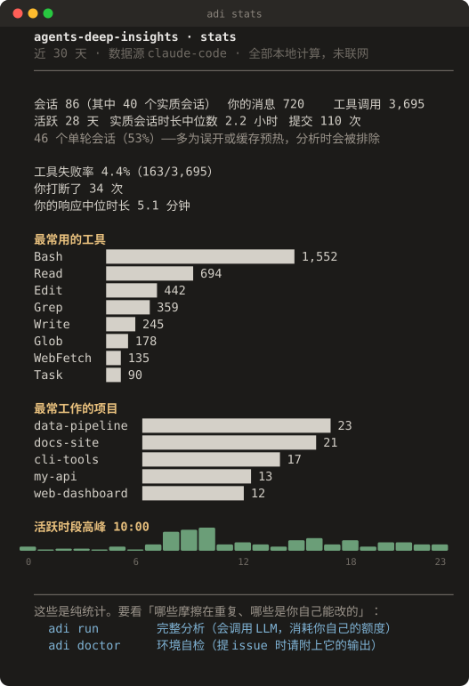
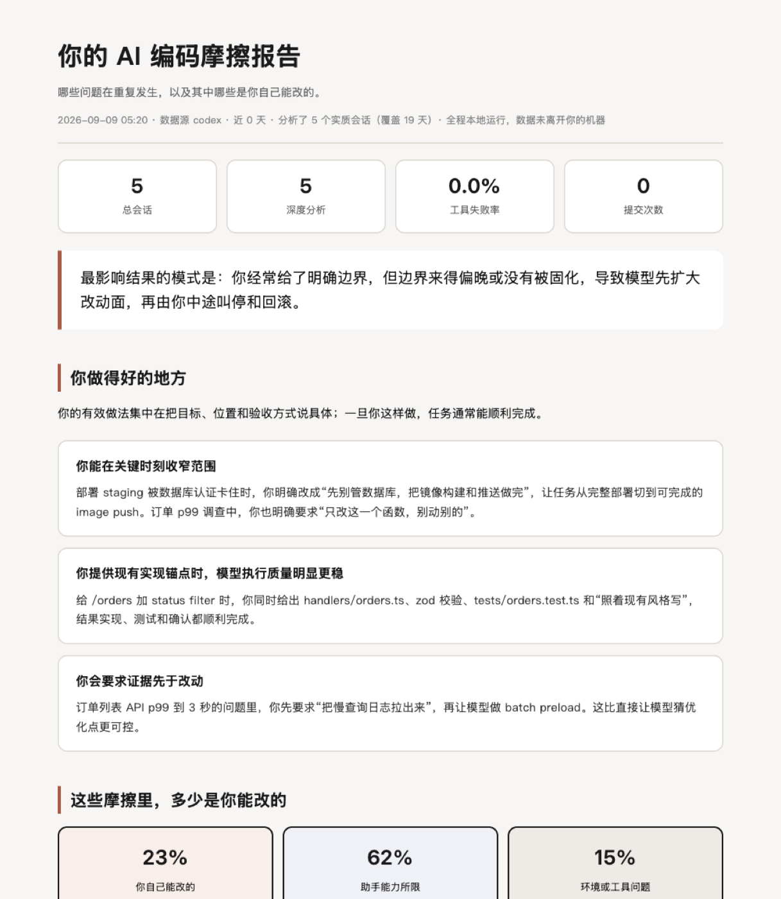

# agents-deep-insights

简体中文 | [English](README.en.md)

把你本地的 AI 编码会话，变成一份**能行动**的报告：哪些问题在重复发生，以及其中**哪些是你自己能改的**。

  



```bash
npx github:gmggyyds/agents-deep-insights          # 上图这个，2 秒出结果，不花额度
```

支持 **Codex CLI** 与 **Claude Code**。采集与统计全部在本地完成，没有遥测、没有账号、没有第三方服务器。
`run` 做深度分析时，会把**脱敏后的会话片段**发给**你自己已经配置好的模型**（`codex exec`）。

> 嫌命令长可以先装：`npm i -g github:gmggyyds/agents-deep-insights`，之后直接敲 `adi`。
> npm registry 版本尚未发布。

---

## 🔒 先说隐私

- **哪些步骤联网，说清楚**：
  `stats` / `doctor` **完全本地**，不联网、不调用模型；
  `run` 会把脱敏后的会话片段发给你自己配置的模型（`codex exec`）——这一步必然联网，
  但走的是你自己的凭证与额度，不经过本工具的任何服务器（本工具没有服务器）；
  首次 `npx` 拉取源码本身也会联网。
- 采集层**默认脱敏**：JWT、`sk-`/`ghp_`/`xoxb-`/`AKIA` 类密钥、URL 里的 token、邮箱、私钥块、超长串，
  在任何内容进入模型之前就被替换掉。
  > 这不是假想需求。开发过程中从一段真实会话提取内容时，里面直接带着一个可用的登录 token。
- `adi doctor` 的输出**只含环境与计数，不含任何会话内容**——它就是设计给你贴进公开 issue 的。

## 🤔 为什么不直接用官方的

Claude Code 有内置 `/insights`，**Codex 什么都没有**。而官方那版有三个实测可复现的问题。

**一、类目会漂，统计因此失真。** 官方在程序里定义了 12 类摩擦，但只写在提示词里、输出侧不校验。
实测一台机器上产出了 **35 类**摩擦、**171 类**目标。同义词碎片直接改排序：

```
tool_failure 17 + tool_limitation 4 + tool_automation_failure 4 = 真实 25
报告只显示 17，低估 32%
```

本工具把枚举写进 JSON Schema 的 `enum`，由**解码层**强制；再配合归一化把同义词合并回去。
同一段会话各跑 3 次的对照：

| 做法 | 输出违规 |
|---|---|
| **写进 schema（本工具）** | **0 / 3** |
| 只写在提示词里（官方做法） | 2 / 3 |
| ChatGPT 网页版 | 2 / 3 |

违规形态不是「造新词」，而是**类型漂移**——计数字段整体变成 `true`/`false`、文本字段变成数组或字典。
这种更危险：字段名全对，浅校验放行，然后在聚合层静默算错。

**二、采样会塌缩，重度用户尤其严重。** 官方取「最近约 50 个会话」。用同一台机器的真实数据对比：

| 取法 | 时间跨度 | 覆盖天数 | 样本量 |
|---|---|---|---|
| 最近 50 个（官方做法） | 14 天 | 11 天 | 50 |
| **按周分层采样（本工具）** | **32 天** | **18 天** | 50 |

样本量完全相同，覆盖翻了一倍多。你用得越多，官方那版就越只反映最近几天。

**三、摩擦混报，读者无法行动。** 12 类摩擦混在一起，你分不清哪些是自己能改的。
本工具增加归因维度，把摩擦拆成 **你能改的 / 助手能力所限 / 环境问题**，
并且只有第一类才进「值得写进 AGENTS.md 的规则」候选。

## ⚡ 三个命令

| 命令 | 用 LLM | 联网 | 花额度 | 说明 |
|---|---|---|---|---|
| `adi stats` | 无 | 无 | 无 | 纯统计。默认命令，**不可能失败** |
| `adi doctor` | 无 | 无 | 无 | 环境自检。`--issue` 直接输出可贴 GitHub 的 markdown |
| `adi run` | 有 | 有 | 有 | 完整分析，出 HTML 报告 |

下面用 `adi` 指代命令；没装全局的话把 `adi` 换成 `npx github:gmggyyds/agents-deep-insights`。

```bash
adi stats --days 7                 # 时间窗（默认 30，0 = 全部）
adi run --limit 30                 # 分析多少个会话
adi run --model gpt-5.5            # Codex 版本旧时指定可用模型
adi run --out ~/report.html        # 报告输出位置
adi doctor --issue                 # 生成可直接贴 issue 的诊断
```

已分析过的会话会按内容指纹缓存，重跑不会重复烧额度。

## 📋 报告里有什么

`adi run` 产出的不是一张统计报表，是一份能照着做的报告：



*上图是用合成数据跑出来的真实产出。注意「你做得好的地方」三条都引用了会话里的原话——报告不引用具体证据就没有价值。*


| 段落 | 内容 |
|---|---|
| 一句话结论 | 你这段时间最要命的那个模式，不是数字总结 |
| 你做得好的地方 | 2-3 条，每条引用会话里的具体情况 |
| **摩擦分三段讲** | **你自己能改的** / 助手能力所限 / 环境或工具问题 |
| 可直接粘贴的规则 | 只从「你能改的」且重复 ≥3 个会话的摩擦生成，写成祈使句 |
| 下一步可以试 | 每条附一段可以直接粘给 agent 的提示词 |
| 原始统计 | 折叠在最后，供你核对上面的结论 |

**摩擦分三段是关键。** 官方 `/insights` 把 12 类摩擦混在一起报，你看完分不清哪些是自己
能改的。分开之后报告能直接说「这些是你下次能改的，具体这样改」——后两段换个提问方式
也不会消失，把注意力放在第一段投入产出比最高。

数字全部由确定性代码计算，模型只负责把它们写成人话并引用证据，不参与计数。

## 🧭 设计原则

**LLM 只打标，代码来计数。**

每个会话的摩擦次数与归因**由模型判定**；跨会话的汇总、排序、门槛判定**全部由确定性代码完成**，代码不对模型的判断做二次修改。
所以报告里的「次数」是模型输出的加总，不是独立测量值——这一点报告里也写明了。
这样报告里的数字可审计、可复现——否则「某类问题出现 62 次」这种结论没法拿来立规矩。

完整设计与实测数据见 [docs/DESIGN.md](docs/DESIGN.md)。

## ⚠️ 已知限制

不藏着，先说清楚：

- **计数字段有 ±1 的边界噪声**。同一段会话跑 3 次，12 类摩擦里约 4 类会有 ±1 波动。
  **单条数字不必细究，趋势和排序才可用。** 分类判断（结果、会话类型）在实测中稳定复现。
- 聚合层能否把这层噪声平均掉，**尚未充分验证**。
- Claude Code 侧目前只读官方生成的 `session-meta`（元数据，不含对话内容），
  因此**深度分析只支持 Codex 会话**；`stats` 两边都支持。
- 只在 macOS + Node 25 + codex-cli 0.131.0 + gpt-5.5 上实测过。
  其他环境请跑 `adi doctor` 并把输出贴进 issue——这正是最需要外部反馈的部分。

## 🔧 要求

- Node.js ≥ 18（**零运行时依赖**，不装任何 npm 包）
- `adi run` 需要 Codex CLI 并已登录

## 📮 交流与反馈

- **Bug 和使用问题**：走 [Issues](https://github.com/gmggyyds/agents-deep-insights/issues)。
  提之前请跑 `adi doctor --issue`，把输出整段贴上——它只含环境与计数，可以安全地贴在公开仓库。
  支持范围见 [SUPPORT.md](SUPPORT.md)。
- **邮件**：gmggyyds@gmail.com
- **公众号**：国民跨境之路

## 🙏 致谢

这个工具的设计站在几个前人肩上，虽然代码是独立编写的：

- Claude Code 内置 `/insights` —— 分层流水线与会话打标的整体思路来自对它行为的观察
- [cosformula/codex-session-insights](https://github.com/cosformula/codex-session-insights) —— Codex 会话的读取方式、`--ephemeral` 冷启动成本模型
- [melagiri/code-insights](https://github.com/melagiri/code-insights) —— 归因维度、「LLM 只叙事不计数」的明确表述、噪声门槛
- [atani/codex-insights](https://github.com/atani/codex-insights) —— 建议分两级（持久规则 / 一次性提示词）

## 📄 License

MIT
